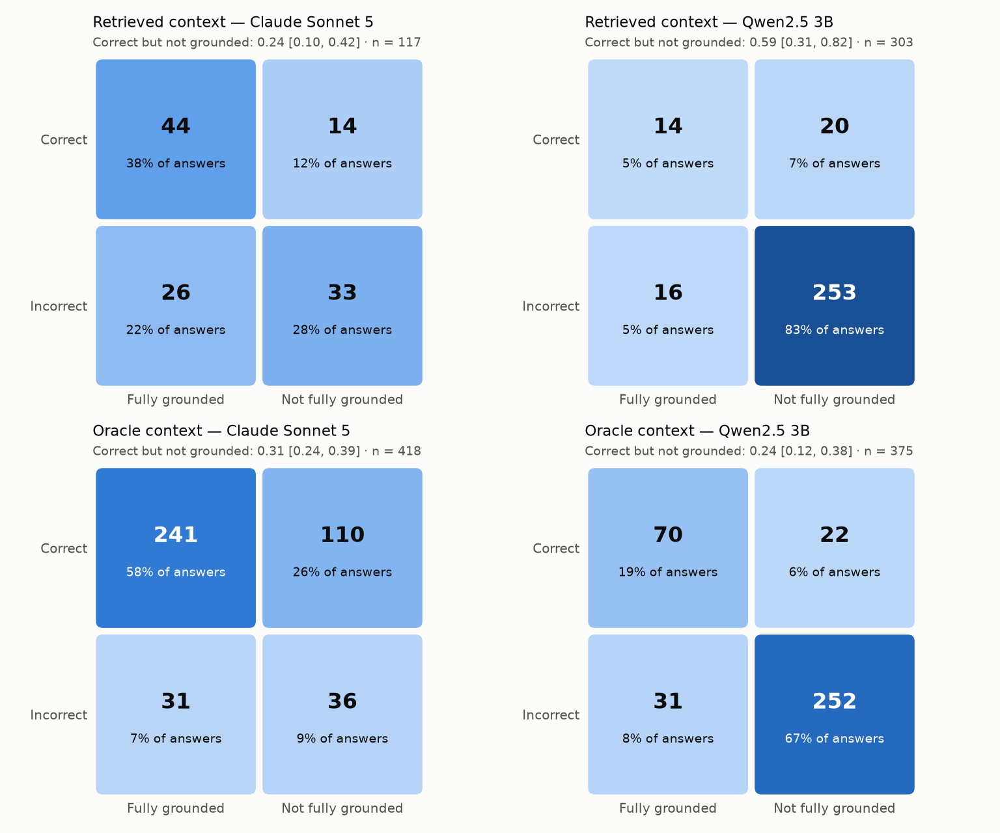
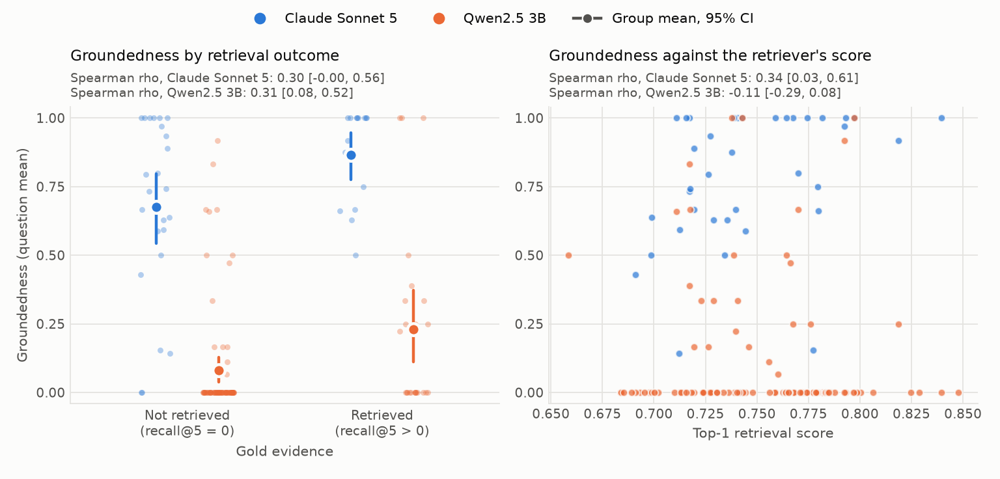
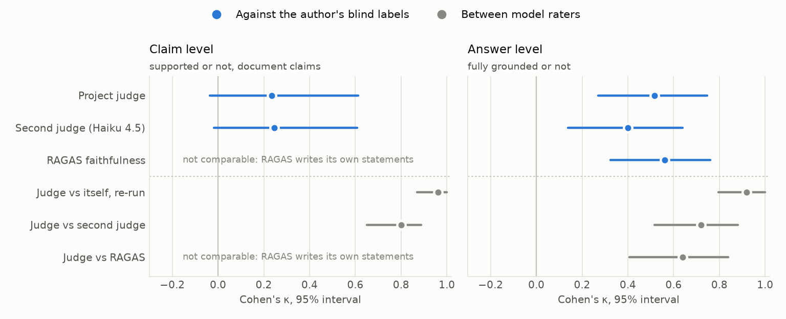
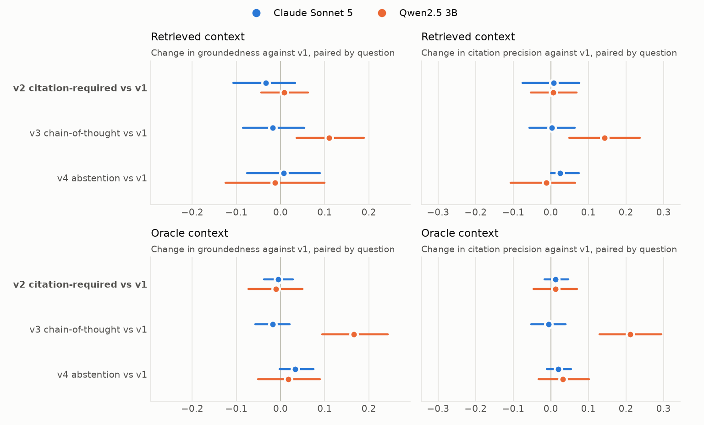
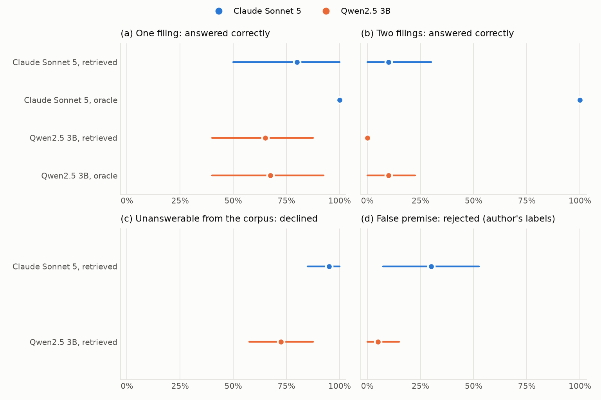
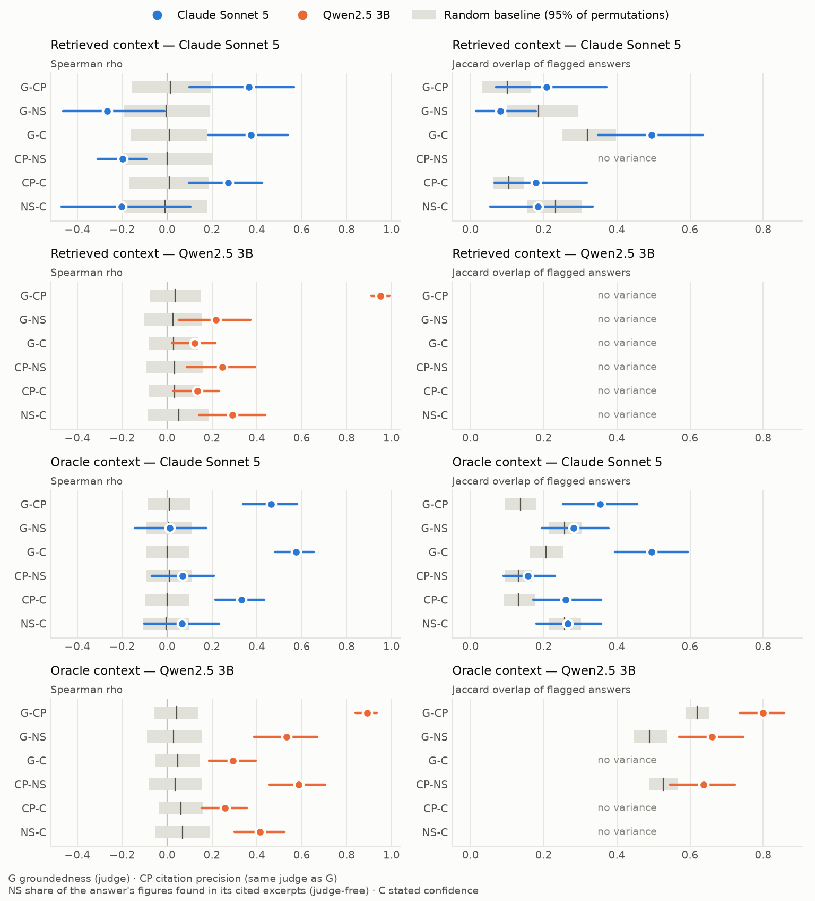

<!-- Generated by scripts/17_readme.py from docs/readme/; edit those, not this. -->
# Measuring Groundedness in RAG over Financial Filings: Technical Report

*Does a retrieval-augmented system get the right answer for the right reasons?*

This is the full technical report, with every table, interval and design decision. [README.md](README.md) is the short, plain-language version.

Accuracy on a question-answering benchmark says whether a system was right, not whether it was right for the right reasons. This project measures the second for retrieval-augmented question answering over SEC filings, on the 150 FinanceBench questions. A reproducible harness separates retrieval failure from generation failure with an oracle-context condition, scores groundedness claim by claim with an LLM judge validated against blind human labels, and serves that score with every answer. The central finding is that correctness and groundedness diverge: with the evidence guaranteed, 31% of Claude Sonnet 5's correct answers are not fully supported by it, yet the judge measuring this agrees with a human only at κ = 0.52 per answer, and RAGAS does no better (κ = 0.56).

## Key Findings

1. **Retrieval, not generation, is the binding constraint.** The best of 36 retrieval configurations reaches recall@5 = 0.179: some gold evidence is in its top five for only 26 of the 126 questions with aligned evidence, and the right filing is missing entirely for 23% of them. For the questions whose evidence retrieval misses, supplying it raises Claude Sonnet 5's answer rate by +69 pp [+61, +77] on the same questions. Under realistic retrieval the selected pipeline declines 0.740 ± 0.007 of all questions (mean ± std over three runs). The retrieval method explains 78.9% of the variance in recall@5 across the grid, and the expected headline, that chunking matters more than the embedding model, holds only because method dwarfs both: within dense retrieval it reverses.

2. **Almost a third of correct answers fail the groundedness check, and about half of those verdicts are the judge's mistakes.** With oracle context, 0.31 [0.24, 0.39] of Claude Sonnet 5's correct answers contain a claim the excerpts do not support. A review of 30 of them by the author found the judge right in 0.50 [0.29, 0.71]; of the 14 it got wrong, 9 broke its own written rules and 5 applied a rule the author disputes. The quadrant is concentrated on questions that ask for a judgement (post hoc: 0.53 of correct answers there, against 0.13 for computed metrics), whose evaluative conclusions the rules count as unsupported. Accuracy alone would report every one of these answers as a success; the judge alone would roughly double the size of the problem.

3. **LLM raters agree with each other far more than with a person.** The project judge agrees with itself on a re-run at κ = 0.96 and with a second model (Haiku 4.5) at κ = 0.80, but with the author's blind labels only at κ = 0.23 [−0.03, 0.61] per claim and 0.52 [0.27, 0.75] per answer. RAGAS faithfulness, run on the same model through its own prompts and its own statement split, lands in the same place: κ = 0.56 [0.32, 0.76] against the author, −0.04 [−0.28, 0.18] from the project judge. Two independent implementations meeting the same ceiling suggests the ceiling is the definition of "supported", not the implementation. Agreement between model raters is evidence of consistency, not of validity.

4. **Good retrieval predicts grounded generation only weakly.** Spearman ρ between a question's recall@5 and the groundedness of its answers is 0.30 [0.00, 0.56] for Claude Sonnet 5 and 0.31 [0.08, 0.52] for Qwen2.5 3B. Retrieving the evidence raises Sonnet's groundedness from 0.68 to 0.87, but it moves the answer rate more, from 0.17 to 0.49: much of retrieval's effect is on whether the model answers at all.

5. **Asking for citations changes nothing measurable.** Requiring the model to quote the excerpt it used moves Claude Sonnet 5's groundedness by 0.00 [−0.04, 0.03] and its citation precision by +0.01 [−0.02, 0.05] under oracle context, against a pre-registered prediction of a real improvement. Over three runs of the realistic pipeline, the zero-shot and citation-required prompts differ in the share of questions answered correctly and fully grounded by +0.4 pp [−0.7, +1.8]. Chain-of-thought is the only variant with an effect, and only for the 3B model (+0.17 in groundedness).

6. **The prompt that permits declining also stops the model correcting false premises.** On ten questions built on a figure that does not exist, Claude Sonnet 5 rejects the premise in 4, 4 and 4 of ten answers under the first three prompts and in 0 of ten under the abstention prompt, which declines instead. It never answered an unanswerable question from its own knowledge (0% of answers), which Qwen2.5 3B did in 20%.


*Correctness and groundedness are separate properties: the off-diagonal cells are populated for every generator and context. With the evidence guaranteed (bottom left), 110 of Claude Sonnet 5's 351 correct answers still fail the groundedness check, while under realistic retrieval most of Qwen2.5 3B's answers are wrong and unsupported at once.*

## Method

### Data

FinanceBench (Islam et al., 2023) supplies 150 human-written questions over 84 public-company filings, each with a gold answer and gold evidence text. The filings are fetched from SEC EDGAR as the HTML the SEC serves for modern 10-K and 10-Q reports; 72 are in scope (8,514 pages), and the rest are earnings releases and other documents outside the corpus. 127 questions have their filing in the corpus and 126 of those have gold evidence aligned to the parsed text, which is what retrieval is scored against. HTML filings use `<table>` for page layout as often as for data, so parsing is a custom `lxml` walker that tells the two apart rather than a generic HTML-to-text library, and every chunk keeps its `(doc_id, page, section, char_span)`. A further 40 adversarial questions were written by hand, ten in each of four categories: answerable from one filing, answerable only by combining two, plausible but unanswerable from the corpus, and built on a false premise.

### Retrieval

The retrieval grid crosses three chunking strategies (fixed-size, `chunk_size=512, overlap=64` characters; recursive-structural, which respects sections; table-aware, which keeps each table whole), three embedding models (`bge-small-en-v1.5`, `all-MiniLM-L6-v2`, `bge-base-en-v1.5`) and four methods (dense FAISS search, BM25, hybrid by reciprocal rank fusion, and hybrid re-ranked by `bge-reranker-base`), 36 cells in all. Every cell is scored against the gold evidence at `k=5` on recall, precision, MRR, nDCG and span recall, and the winner by recall@5 was fixed before any answer was generated. FAISS and Qdrant sit behind one adapter and return equivalent top-k, so the backend is a configuration choice.

### Generation

Two generators answer every question: Claude Sonnet 5 through the API with thinking off (the model rejects sampling parameters, so its answers are reproducible from an on-disk response cache rather than from a seed), and Qwen2.5 3B Instruct locally through Ollama at `temperature=0` with a fixed seed, chosen because a 7B model does not fit the 4 GB card. Four versioned prompt files are compared: zero-shot, citation-required (the answer must quote the excerpt it used), chain-of-thought, and abstention-encouraged. Each runs under two context conditions. **Retrieved** uses the winning retriever over the whole corpus for all 150 questions. **Oracle** builds the five excerpts from the chunks that contain the gold evidence, topped up with the filing's best-scoring other chunks and ordered by retrieval score, for the 126 questions with aligned evidence. Holding generation fixed while guaranteeing the evidence separates retrieval failure from generation failure by construction. Every one of the 2,208 generations is a trace (question, excerpts, prompt version and hash, model, raw output, parsed answer and citations) that replays from the cache.

### Evaluation

Four metric families score every answer. *Correctness* compares numeric answers with the gold at a relative tolerance of `rel_tol=0.01` and separates unit errors (a figure in thousands read as millions) from wrong answers; other answers are graded by an LLM judge, which agrees with the numeric matcher at κ = 0.94 where both apply. *Groundedness* is written from scratch before any library was used: a judge splits the answer into atomic claims, classed as about the company, about the excerpts, or general finance, and a second call checks each claim against the excerpts the generator saw; the score is supported company claims over company claims, and an answer is *fully grounded* when all are supported. *Citation precision* is the share of cited excerpts that support a claim. *Abstention* records whether the model declined, by a rule and by the judge (κ = 0.87 between the two). The judge is Claude Sonnet 5 with thinking off, constrained to a JSON schema and run through the Message Batches API. It was validated on 50 answers (202 claims) that the author labelled blind to the judge, the gold answer, the citations and the generator. The reliability analysis was pre-registered: every prediction was written down before any number was computed, and 10 of the 20 that could be checked turned out wrong.

### External check and repeated runs

Two additions test the harness from outside. RAGAS faithfulness (Es et al., 2023; `ragas` 0.4.3) scores the same 50 labelled answers on the same model as the project judge, so a difference reflects the method, not the model; only the transport is replaced, since RAGAS's own Anthropic path sends sampling parameters that Claude Sonnet 5 rejects. The two tied candidates for the served pipeline (retrieved context, Claude Sonnet 5, zero-shot and citation-required) were generated and judged twice more, so their numbers carry a measured spread. Everything else is a single run and is labelled as one where it is reported.

## Results

### Retrieval

| Method | Mean recall@5 (9 cells) | Best cell | recall@5 | recall@20 | Right filing in top 5 | MRR |
|---|---|---|---|---|---|---|
| dense | 0.120 | fixed_size + bge-small-en-v1.5 | 0.179 | 0.270 | 0.770 | 0.137 |
| hybrid + rerank | 0.084 | fixed_size + bge-base-en-v1.5 | 0.103 | 0.242 | 0.722 | 0.092 |
| hybrid | 0.067 | fixed_size + all-MiniLM-L6-v2 | 0.099 | 0.135 | 0.611 | 0.064 |
| bm25 | 0.029 | fixed_size + bge-small-en-v1.5 | 0.032 | 0.060 | 0.341 | 0.012 |

<sub>Source: `results/metrics/retrieval_grid.json` (126 questions; deterministic)</sub>

Dense search wins in every chunking and embedding combination but one, where it ties hybrid. **BM25 finds a chunk from the right filing in its top five for only 34% of questions**, against 77% for the best dense cell: FinanceBench questions share templates ("positive working capital based on FY2022 data"), so lexical overlap points at other companies' identical wording, and fusing BM25 in makes dense retrieval worse. Re-ranking recovers part of that loss but does not earn its latency here. The winner (`fixed_size` + `bge-small-en-v1.5` + dense) is not statistically separable from the next three cells: its lead over the runner-up is +0.036 [−0.020, 0.091] in recall@5. Absolute retrieval is low; the best recall@20 in the grid is 0.329.

| Share of between-cell variance in recall@5 | Method | Chunking | Embedding |
|---|---|---|---|
| All 36 cells | 78.9% | 7.8% | 0.5% |
| Dense only (9 cells) | – | 30.6% | 52.9% |

<sub>Source: `results/metrics/retrieval_grid.json` (`factor_decomposition`)</sub>

**The retrieval method dominates everything else**, at 78.9% of the between-cell variance in recall@5. The expected result was that chunking would matter more than the embedding model; that holds only because both are dwarfed by method, and holding the method at dense reverses it, with the embedding model explaining 52.9% and chunking 30.6%. Retrieval is deterministic, so these numbers carry no run-to-run variance; the interval above resamples questions.

### Correctness and groundedness

| Context | Generator | Answers | Accuracy (all) | Accuracy (answered) | Groundedness | Fully grounded | Citation precision | Declined (share of answers) |
|---|---|---|---|---|---|---|---|---|
| oracle | Claude Sonnet 5 | 504 | 0.70 | 0.83 | 0.87 | 0.65 | 0.92 | 0.16 |
| oracle | Qwen2.5 3B | 504 | 0.18 | 0.24 | 0.36 | 0.27 | 0.29 | 0.23 |
| retrieved | Claude Sonnet 5 | 600 | 0.10 | 0.43 | 0.80 | 0.59 | 0.92 | 0.78 |
| retrieved | Qwen2.5 3B | 600 | 0.06 | 0.11 | 0.14 | 0.10 | 0.12 | 0.47 |

<sub>Source: `results/metrics/eval_main.json` (`by_condition_model`; four prompts pooled; single run; groundedness and citation precision are judge-measured)</sub>

With the evidence guaranteed, Claude Sonnet 5 answers 0.83 of its answered questions correctly and cites excerpts that support its claims with precision 0.92; Qwen2.5 3B manages 0.24, and its low groundedness is mostly wrong answers rather than unsupported right ones. Under realistic retrieval **Claude Sonnet 5 declines 78% of all answers**, the behaviour a recall@5 of 0.179 calls for, and on truly unanswerable questions it declines 95%. Its answers under retrieval are almost as grounded as under oracle context; what retrieval takes away is the chance to answer.

| Context | Generator | Graded answers | Correct + grounded | Correct + ungrounded | Incorrect + grounded | Incorrect + ungrounded | Correct but not fully grounded |
|---|---|---|---|---|---|---|---|
| oracle | Claude Sonnet 5 | 418 | 241 | 110 | 31 | 36 | 0.31 [0.24, 0.39] |
| oracle | Qwen2.5 3B | 375 | 70 | 22 | 31 | 252 | 0.24 [0.12, 0.38] |
| retrieved | Claude Sonnet 5 | 117 | 44 | 14 | 26 | 33 | 0.24 [0.10, 0.42] |
| retrieved | Qwen2.5 3B | 303 | 14 | 20 | 16 | 253 | 0.59 [0.31, 0.82] |

<sub>Source: `results/metrics/reliability_analysis.json` (`q2`; single run; 95% intervals resample questions)</sub>

The right-answer-wrong-reasons share is the fraction of correct answers that are not fully grounded. It is high in every cell, but the next section shows how much of it is the judge.


*Retrieving the evidence helps, but the two clouds overlap heavily: Claude Sonnet 5 writes fully grounded answers to many questions whose gold evidence was never retrieved, supported by the excerpts it was shown instead, and the retriever's own score says almost nothing about the 3B model's groundedness.*

### Validating the judge

| Raters (50 answers) | Claim-level κ (supported or not) | Answer-level κ (fully grounded) | Answer-level raw agreement |
|---|---|---|---|
| Author vs project judge (Sonnet 5) | 0.23 [−0.03, 0.61] | 0.52 [0.27, 0.75] | 0.76 |
| Author vs second judge (Haiku 4.5) | 0.25 [−0.02, 0.61] | 0.40 [0.14, 0.64] | 0.70 |
| Project judge vs second judge | 0.80 [0.65, 0.89] | 0.72 [0.52, 0.88] | 0.86 |
| Project judge vs itself (cache bypassed) | 0.96 [0.87, 1.00] | 0.92 [0.80, 1.00] | 0.96 |
| Author vs RAGAS faithfulness | – (own statements) | 0.56 [0.32, 0.76] | 0.78 |
| Project judge vs RAGAS faithfulness | – (own statements) | 0.64 [0.41, 0.84] | 0.82 |

<sub>Source: `results/metrics/judge_agreement.json`, `results/metrics/ragas_faithfulness.json` (single run; 95% bootstrap intervals; claim level resamples answers)</sub>

**The two LLM judges agree with each other (0.80) and with themselves (0.96) far more than either agrees with the author.** Claim-level agreement with the author is barely above chance and its interval includes zero; answer-level agreement is moderate. RAGAS agrees with the author at 0.56, statistically indistinguishable from the project judge (−0.04 [−0.28, 0.18] in κ), and correlates with the author's per-answer scores at ρ = 0.69, against 0.58 for the project judge. The comparison favours the project judge by construction, because the author labelled that judge's own claims, and RAGAS still matches it. RAGAS split each answer into 4.1 statements on average and scored all 50.


*Every model-to-model estimate sits to the right of every model-to-author estimate, although at the answer level the intervals overlap. Consistency between LLM raters is high and says little about whether any of them agrees with a careful reader.*

### The selected pipeline over three runs

| Metric | v1 zero-shot: mean ± std (runs 0 / 1 / 2) | v2 citation-required: mean ± std (runs 0 / 1 / 2) |
|---|---|---|
| Correct and fully grounded (all 150) | 0.067 ± 0.013 (0.080 / 0.067 / 0.053) | 0.062 ± 0.017 (0.080 / 0.060 / 0.047) |
| Accuracy (all 150) | 0.096 ± 0.010 (0.107 / 0.093 / 0.087) | 0.091 ± 0.010 (0.093 / 0.100 / 0.080) |
| Accuracy (answered) | 0.367 ± 0.030 (0.400 / 0.359 / 0.342) | 0.380 ± 0.048 (0.378 / 0.429 / 0.333) |
| Declined | 0.740 ± 0.007 (0.733 / 0.740 / 0.747) | 0.760 ± 0.007 (0.753 / 0.767 / 0.760) |
| Groundedness (scored answers) | 0.813 ± 0.014 (0.805 / 0.806 / 0.830) | 0.806 ± 0.041 (0.762 / 0.843 / 0.813) |
| Citation precision | 0.920 ± 0.034 (0.904 / 0.958 / 0.896) | 0.931 ± 0.026 (0.914 / 0.961 / 0.917) |

<sub>Source: `results/metrics/replicates.json` (three runs; std is the sample standard deviation)</sub>

The served pipeline was selected by a rule fixed before any arm was compared: the retrieved-condition arm with the highest share of all its questions answered correctly and fully grounded. In the original run the zero-shot and citation-required prompts tied at 12 of 150 and the tie went to zero-shot on accuracy. **Over three runs the two prompts remain indistinguishable**: averaged per question across runs, zero-shot minus citation-required is +0.4 pp [−0.7, +1.8], and zero-shot wins the rule in 3 of 3 runs. The original run was the best of the three for both prompts: zero-shot answered 0.080 of questions correctly and fully grounded in it, against 0.067 ± 0.013 over all three, so a single run of this pipeline is one draw and a flattering one here. Run to run, 4 of the 150 questions change between correct-and-grounded and not under zero-shot, and 8 change between declined and answered: a served answer is one sample, and so is its score.

### Prompt variants


*Only chain-of-thought moves anything, and only for the 3B model, where it raises groundedness and citation precision together. The citation-required prompt (bold, the pre-registered contrast) sits on zero for both generators and both conditions: at most it changes how many excerpts are cited, not whether the cited ones support the answer.*

The pre-registered question was whether citation-required prompting improves groundedness or only its appearance, with citation precision separating the two. It does neither. Under oracle context Claude Sonnet 5's groundedness moves by 0.00 [−0.04, 0.03]; the one thing it changes is the number of excerpts cited, which falls. The abstention prompt lowers Claude Sonnet 5's answer rate under retrieval from 0.27 to 0.14 without changing the groundedness of what it does answer.

### Adversarial questions

| Category (10 questions each) | Context | Generator | Accuracy | Declined |
|---|---|---|---|---|
| (a) one filing | oracle | Claude Sonnet 5 | 1.00 | 0.00 |
| (a) one filing | oracle | Qwen2.5 3B | 0.68 | 0.00 |
| (a) one filing | retrieved | Claude Sonnet 5 | 0.80 | 0.00 |
| (a) one filing | retrieved | Qwen2.5 3B | 0.65 | 0.03 |
| (b) two filings | oracle | Claude Sonnet 5 | 1.00 | 0.00 |
| (b) two filings | oracle | Qwen2.5 3B | 0.10 | 0.03 |
| (b) two filings | retrieved | Claude Sonnet 5 | 0.10 | 0.80 |
| (b) two filings | retrieved | Qwen2.5 3B | 0.00 | 0.25 |
| (c) unanswerable | retrieved | Claude Sonnet 5 | – | 0.95 |
| (c) unanswerable | retrieved | Qwen2.5 3B | – | 0.72 |
| (d) false premise | retrieved | Claude Sonnet 5 | – | 0.72 |
| (d) false premise | retrieved | Qwen2.5 3B | – | 0.62 |

<sub>Source: `results/metrics/reliability_analysis.json` (`q4`; four prompts pooled; single run)</sub>

**Two-filing questions fail at retrieval, not at reasoning**: with both filings' evidence supplied, Claude Sonnet 5 answers every one correctly under all four prompts; under retrieval its accuracy is 0.10 and it declines 80% of the time, because only 1 of the ten questions retrieves any evidence at all. On unanswerable questions it declines 95%. The false-premise results use the author's blind labels (a premise judge agrees with them at κ = 0.81): Claude Sonnet 5 rejects the premise in 0.30 [0.07, 0.53] of answers, Qwen2.5 3B in 0.05, and the 3B model accepts the invented figure and answers with it in 13 of its 40 answers.


*Each panel shows the behaviour its category rewards. Guaranteeing the evidence turns the two-filing category from Claude Sonnet 5's worst into a perfect score, which locates the failure in retrieval; the false-premise panel is the one where neither model does well.*

### Do independent reliability signals agree?


*For Claude Sonnet 5 under oracle context, the model's stated confidence tracks the judge's groundedness better than a judge-free check does: the share of an answer's figures found in its cited excerpts is uncorrelated with groundedness. Grey bands are the random baseline from permuting one signal against the other.*

Groundedness (G), citation precision (CP, from the same judge), a judge-free check of whether an answer's figures appear in its cited excerpts (NS), and stated confidence (C) were compared pairwise against a permutation baseline. The pre-registered expectation was that the judge-free check would agree with groundedness and confidence would not. The opposite happened for Claude Sonnet 5 under oracle context: G-C correlates at ρ = 0.57 [0.48, 0.65], G-NS at 0.01 [−0.14, 0.17]. Why the judge-free check fails here is open. The obvious explanation, that it cannot see derived figures (a ratio or a sum never appears verbatim in an excerpt), predicts a weaker correlation on the computational questions, and the post hoc split shows the opposite: ρ = 0.28 on metrics-generated questions and −0.04 on the rest. For the 3B model, whose stated confidence is near the maximum on almost everything, the confidence flag has no variance at all.

## What the Judge Gets Wrong

The claim-level κ of 0.23 hides two opposite systematic disagreements rather than noise. On entity and period matching the author was more lenient than the judge: a list of AMD products supported only by the FY2015 10-K and claimed "as of FY22", or background facts absent from the excerpts, were labelled supported by the author and not by the judge. On figures derived by arithmetic or read across excerpts the author was stricter: Adobe's free cash flow, computed from rows of one table whose year header sat in a different excerpt, and Microsoft's total debt as the sum of two lines. Two answers account for most of the disagreement: a 26-claim AMD product list and the Adobe answer. A labelling rule adopted part-way through (a figure whose year column is cut off is unsupported unless another excerpt settles it) is stricter than the judge's prompt, and likely contributed to the second direction. Per generator, κ is unstable for a plainer reason: on Claude Sonnet 5's claims both raters call most claims supported, so raw agreement is high and κ collapses toward zero, the familiar prevalence paradox.

The author later adjudicated four answers where the blind labels had departed from the written rules, changing 34 claims to the judge's verdict. Adjudicated agreement rises to κ = 0.73 per claim, but it is reported only beside the blind figure, never in place of it, because the changed claims match the judge by construction.

The review of the correct-but-ungrounded quadrant sharpens this. Of 14 verdicts the author judged wrong, 9 were the judge breaking its own rules: decomposing statements about the excerpts as facts about the company, copying a word from the question into every claim, returning a verdict that contradicts its own reason. The other 5 were the judge applying a rule correctly where the author thinks the rule is wrong for the case: an evaluative conclusion such as "not a high-growth company" counts as unsupported unless an excerpt says so. The first kind is a judge error; the second is a definitional choice, and it is the one no better judge would remove.

Three decisions were reversed along the way, each with the evidence on both sides. The first local model was to be a 7B or 8B model; even quantised it would not fit a 4 GB card and would have run partly on the CPU, so a 3B model was chosen that runs entirely on the GPU, at a known cost in quality. The oracle condition did not exist in the original design; it was added after the first full run showed recall@5 at 0.179, low enough that realistic retrieval alone could not separate a model that reasons badly from one that was never shown the evidence. And the rule that a question whose filing is missing from the corpus is unanswerable turned out wrong for 8 of 23 such questions, whose answer another filing in the corpus holds; an audit reclassified them before the final numbers, raising Claude Sonnet 5's measured decline rate on truly unanswerable questions to 95%.

## Deployment

The selected pipeline is served by a FastAPI service whose `POST /query` returns the answer, its citations, a latency breakdown and **the groundedness score of that answer**, computed by the same judge, prompts and model as the evaluation. Every score travels with the judge's measured agreement with the author (κ = 0.52 per answer), and the service refuses to start if a judge prompt's hash differs from the validated one, since the κ would no longer describe it. Loaded from its serving bundle alone, the service reproduces all 150 evaluated answers of the selected arm and their groundedness to the claim verdict. `GET /health`, `GET /ready` and Prometheus `GET /metrics` are exposed, every request is logged as JSON lines, and spend is capped per deployment. The architecture is drawn in [docs/architecture.md](docs/architecture.md).


*A grounded answer, a correct answer the judge scores zero because the five excerpts do not support it, and the κ that travels with every score. Answers are replayed from the cache, so the latency shown is the service's own.*

| Concurrent users | Requests/s | p50 ms | p95 ms | p99 ms | Errors |
|---|---|---|---|---|---|
| 1 | 13.9 | 76 | 124 | 143 | 0 |
| 2 | 24.7 | 74 | 131 | 172 | 0 |
| 4 | 26.1 | 149 | 194 | 223 | 0 |
| 8 | 23.3 | 345 | 388 | 416 | 0 |
| 16 | 21.9 | 732 | 790 | 813 | 0 |

<sub>Source: `results/metrics/load_test.json` (`replay`; single run; the load generator shares the machine)</sub>

With every model response replayed from the cache, throughput saturates at about 26 requests per second from 4 users, and beyond that latency grows with the queue. The bottleneck is embedding the query on the CPU; the vector search takes about 6 ms at the median. Live, on 20 questions, an answer takes 8.4 s at the median and 17.5 s at the 95th percentile, and costs $0.016 on average. **The groundedness judge is 75% of that cost and 75% of the time**: measuring whether an answer is grounded costs 3 times as much as producing it. A fresh answer is a different sample, too: re-asking the 20 questions gave the identical text in 3 cases and the same groundedness in 15, most of those because neither answer had a score.

Kubernetes manifests (deployment with probes, service, configmap and a CPU autoscaler) were verified on a local `kind` cluster: the rollout took 10.6 s, and under eight concurrent users the autoscaler added replicas, the first ready after 51 s. What a real cluster would need differently is written up in [k8s/README.md](k8s/README.md): shared rather than per-pod state for the spend cap and cache, a scaling signal based on requests in flight rather than CPU once requests wait on the model API, and the index as a service rather than baked into the image. From a fresh clone, `docker compose up` with only an API key added returned the first answer after 277.4 s against a five-minute target; the 1.0 GB image download dominates, so a slower connection would miss it.

## Reproducing the Results

Dependencies are managed with `uv`, and `uv sync` installs the pipeline. Development and every run used an RTX 3050 4GB; embedding also runs on CPU, more slowly. Each script below is a DVC stage, run in this order; the first four build the corpus, the embeddings and the indices from nothing, and the rest replay every model call from the response caches. The pilot runs, the adversarial set's validation and context build, and the premise-judge pilot are further stages, not timed here.

|  | Script | What it does | Mode | Time |
|---|---|---|---|---|
| 1 | `01_ingest.py` | parse the filings into text with page and section metadata | from scratch | 40 s |
| 2 | `02_chunk.py` | the three chunking strategies | from scratch | 14 s |
| 3 | `03_build_index.py --embed-only (9 configurations)` | every embedding set, computed from scratch on the GPU | from scratch | 63 min |
| 4 | `03_build_index.py --all` | every FAISS and Qdrant index, and the backend equivalence check | from scratch | 6 min |
| 5 | `04_eval_retrieval.py` | the retrieval grid against the gold evidence | replayed | 26 min |
| 6 | `04b_scoped_retrieval.py` | retrieval restricted to the question's own filing | replayed | 32 s |
| 7 | `05_generate.py` | every generation trace, checked against Phase 3's rankings | replayed | 45 s |
| 8 | `05_generate.py --verify-replay` | every trace re-rendered, re-keyed and re-parsed | replayed | 5 s |
| 9 | `06_eval_generation.py` | the four metric families on every trace | replayed | 44 s |
| 10 | `06b_judge_validation.py` | judge agreement with the author's labels | replayed | 28 s |
| 11 | `07b_adversarial_run.py (generate)` | the adversarial questions: answers | replayed | 26 s |
| 12 | `07b_adversarial_run.py (evaluate)` | the adversarial questions: judging | replayed | 9 s |
| 13 | `07_reliability_analysis.py` | the pre-registered reliability analysis and its plots | replayed | 2 min |
| 14 | `09_track_experiments.py select` | the pipeline selection rule | replayed | 4 s |
| 15 | `09_track_experiments.py track` | MLflow rebuilt from the results; the pipeline registered | replayed | 20 s |
| 16 | `12_serving.py bundle` | the serving bundle baked into the API image | replayed | 14 s |
| 17 | `12_serving.py check` | the service reproduces every evaluated answer | replayed | 20 s |
| 18 | `15_ragas_faithfulness.py` | RAGAS faithfulness on the labelled answers | replayed | 29 s |
| 19 | `16_replicates.py` | the two extra runs of the tied arms | replayed | 16 s |
|  | **all stages** |  |  | **1.7 h** |

<sub>Source: `results/metrics/runtimes.json` (the development machine on mains power; from-scratch stages timed once, replayed stages the slower of two runs)</sub>

The raw filings and every cached model response are published as two archives on the `data-v1` release (30 MB and 14 MB). `scripts/19_data_release.py restore` downloads them and checks their SHA-256, fetches FinanceBench from Hugging Face at the pinned revision rather than redistributing it, and confirms that every DVC root matches its recorded hash. From there `dvc repro --force` rebuilds every stage without calling a model API (the network is needed only for the embedding models and the RAGAS environment's packages), and `scripts/11_verify_reproduction.py` compares the rebuilt results with a copy taken beforehand, field by field; the only differences it allows are listed in the script with their reasons, such as timings and the last digits of GPU embedding arithmetic. Qdrant must be running for the index stage.

```bash
uv sync
uv run python scripts/19_data_release.py restore        # raw filings and every model response
docker compose up -d qdrant                             # the second vector backend
cp -r results ../results_committed                      # the reported numbers, for comparison
dvc repro --force                                       # every stage, no model API calls
uv run python scripts/11_verify_reproduction.py ../results_committed
uv run python scripts/17_readme.py --check              # this README against the results
```

Regenerating answers or judge verdicts rather than replaying them calls the Claude API and draws new samples, since Claude Sonnet 5 accepts no seed: the whole project spent $27.15 across 8,531 calls, recorded per phase in `results/metrics/api_spend.json`. Every response is cached on disk by a hash of its request, so re-running a finished stage is free. The RAGAS comparison runs in its own environment, which its script creates on first use. To serve the pipeline, add an API key to `.env` and run `docker compose up`.

## Limitations

Every groundedness number here is a model's judgement checked by one person on 50 answers, and that check is the weakest link: claim-level agreement with the author is barely above chance, the author's own labels shifted on a second reading of four answers against the rules, and the judge and RAGAS share a model family with one of the two generators they grade. A second rater of the same family agreeing with the first says little. Only the two tied candidates for the served pipeline were run three times; every other comparison, including the whole prompt ablation, the oracle condition and the adversarial set, is a single run, and the replicates show that a single run of this pipeline moves by several questions in each direction. The benchmark is small (150 questions, 126 with aligned evidence, 40 adversarial questions at ten per category) and covers one domain and one document type, so the intervals are wide and the findings may not carry to contracts, medical records or anything outside US public-company filings.

The metrics have blind spots of their own. Citation precision can only credit an excerpt the judge finds supporting, so it inherits every judge error; the judge-free figure check cannot see derived numbers; and a fully grounded answer can still be wrong when the excerpt it faithfully repeats is the wrong year or the wrong company, which is exactly the entity confusion that whole-corpus retrieval produces. The service is a demonstration of the measurement, not a production system: it has no authentication, no rate limiting beyond a spend cap, no monitoring beyond Prometheus counters, no process for new filings as they are published, and its judge adds 3 times the cost of the answer it scores.

## Dependencies

| Package | Purpose |
|---|---|
| anthropic | Claude Sonnet 5 generation and the groundedness judge, through the Messages and Message Batches APIs |
| ollama | Local Qwen2.5 3B generation at a fixed seed |
| sentence-transformers | The three embedding models and the `bge-reranker-base` cross-encoder |
| faiss-cpu | The primary vector index, behind the project's store adapter |
| qdrant-client | The second vector backend, run in Docker |
| rank-bm25 | BM25 scoring for the lexical and hybrid arms |
| lxml | The HTML filing parser that separates layout tables from data tables |
| pymupdf | The PDF parsing path (unexercised: every filing in the corpus is HTML) |
| ragas | The external faithfulness metric compared with the project's judge |
| mlflow | Experiment tracking of every evaluated arm and the registered pipeline |
| dvc | The versioned corpus, caches and the pipeline that rebuilds every result |
| fastapi + uvicorn | The served API |
| prometheus-client | The service's request, latency and spend metrics |
| locust | The replay load test |
| matplotlib | Every plot |

## References

Cohen, J. (1960). *A Coefficient of Agreement for Nominal Scales*. Educational and Psychological Measurement.

Es, S., James, J., Espinosa-Anke, L., & Schockaert, S. (2023). *RAGAS: Automated Evaluation of Retrieval Augmented Generation*. arXiv:2309.15217.

Islam, P., Kannappan, A., Kiela, D., Qian, R., Scherrer, N., & Vidgen, B. (2023). *FinanceBench: A New Benchmark for Financial Question Answering*. arXiv:2311.11944.

Karpukhin, V., Oğuz, B., Min, S., Lewis, P., Wu, L., Edunov, S., Chen, D., & Yih, W. (2020). *Dense Passage Retrieval for Open-Domain Question Answering*. EMNLP.

Lewis, P., Perez, E., Piktus, A., Petroni, F., Karpukhin, V., Goyal, N., Küttler, H., Lewis, M., Yih, W., Rocktäschel, T., Riedel, S., & Kiela, D. (2020). *Retrieval-Augmented Generation for Knowledge-Intensive NLP Tasks*. NeurIPS.

Robertson, S., & Zaragoza, H. (2009). *The Probabilistic Relevance Framework: BM25 and Beyond*. Foundations and Trends in Information Retrieval.

Zheng, L., Chiang, W.-L., Sheng, Y., Zhuang, S., Wu, Z., Zhuang, Y., Lin, Z., Li, Z., Li, D., Xing, E. P., Zhang, H., Gonzalez, J. E., & Stoica, I. (2023). *Judging LLM-as-a-Judge with MT-Bench and Chatbot Arena*. NeurIPS Datasets and Benchmarks.
