# Architecture

Two halves share one set of code: the offline pipeline that produced every reported number
(`dvc.yaml`), and the served API that answers one question at a time with the pipeline it
selected. The API's groundedness score is the offline judge applied to a single answer,
which is why a served score and an evaluated score of the same answer are identical
(`results/metrics/serving_check.json`).

```mermaid
flowchart LR
    subgraph offline["Offline pipeline: dvc repro"]
        direction TB
        raw["EDGAR filings + FinanceBench<br/>(DVC roots)"] --> ingest["ingest, chunk<br/>3 strategies"]
        ingest --> embed["embed<br/>3 models"] --> index["FAISS / Qdrant<br/>indices"]
        index --> retrieve["retrieval grid<br/>36 cells"] --> generate["generate<br/>2 models x 4 prompts"]
        generate --> evaluate["evaluate<br/>correctness, groundedness,<br/>citations, abstention"]
        evaluate --> analyse["reliability analysis"]
        evaluate --> select["select pipeline<br/>(MLflow registry)"]
        cache[("LLM response cache<br/>(DVC root)")] <-.-> generate
        cache <-.-> evaluate
        select --> bundle["serving bundle<br/>index + weights + cached responses"]
    end

    subgraph api["API container"]
        direction TB
        q["POST /query"] --> emb["embed query<br/>bge-small, CPU"]
        emb --> faiss["FAISS search<br/>top k=5"]
        faiss --> gen["generate<br/>Claude Sonnet 5, v1 prompt"]
        gen --> dec["judge: decompose<br/>into claims"]
        dec --> ver["judge: verify claims<br/>against the 5 chunks"]
        ver --> out["answer + citations +<br/>groundedness + validation kappa<br/>+ latency per stage"]
        rc[("response cache<br/>bundle, then state volume")] <-.-> gen
        rc <-.-> dec
        rc <-.-> ver
        out --> obs["/metrics (Prometheus)<br/>JSONL request log"]
    end

    bundle -- "baked into the image" --> api
    claude(["Anthropic API"]) <-.-> gen
    claude <-.-> dec
    claude <-.-> ver
```

*The served answer passes through the same judge that was validated against the author's
labels, so every score arrives with that validation's kappa. Model calls are read from the
response cache first; a question the cache does not hold costs three API calls, capped per
state volume.*

The compose stack adds Qdrant (the second vector-store backend, whose reachability
`/health` reports) and the MLflow tracking server holding the runs and the registered
pipeline; `k8s/api.yaml` deploys the API alone, with a CPU-based autoscaler.
